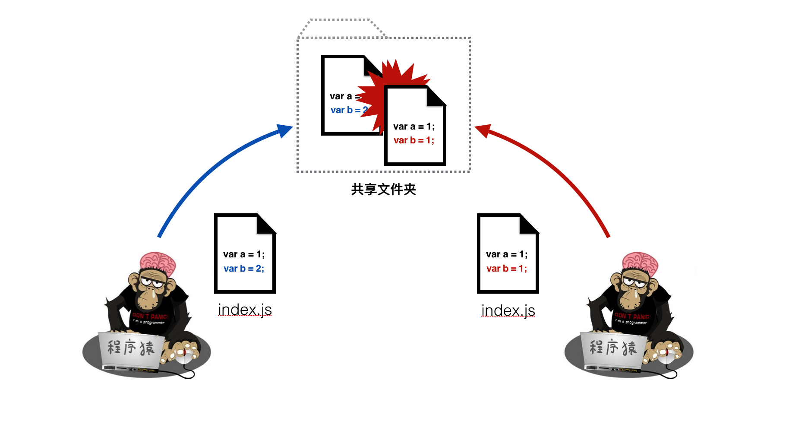
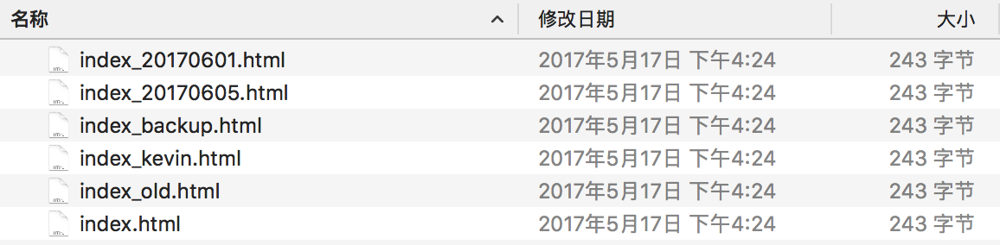

# 代码管理工具简介
简单地说，源码管理工具是一种让多个程序员可以同时协作开发，用于管理代码和记录代码编辑历史的工具。

## 为什么要使用代码管理工具？
想象一下，如果要把代码文件还原到修改前的状态，我们会怎么做？
最简单的办法就是在编辑代码前，先备份源代码文件。在备份的时候，为了更好的区分文件，我们通常会在备份的文件名或目录名上添加一些标识来区分版本，如时间或者作者信息等。如下面所示：

但是上面的方法存在着下面的问题：

* 操作繁琐且易出错：每次编辑之前，都需要提前备份一下文档，即麻烦且容易遗漏
* 命名规则定义：如果备份文件的命名规则没有定义好，会导致文件混乱以致难以区分最新的文档
* 无法多人同时协作：如果两个人同时编辑相同的代码文件，后面的人修改的内容会覆盖前面的人修改的内容

而这个时候，我们就可以使用代码管理工具来解决这些问题。

## 代码管理工具的作用
使用代码管理工具可以实现：

* 对代码进行版本管理，记录修改历史，并且可以随时恢复到之前的任意版本
* 能对多人提交的代码进行自动合并和冲突解决，最终实现多人同时协作开发

# 常用代码工具介绍
常见的代码管理工具一般分为2类:

* 一种是集中式代码管理工具如 SVN
* 一种是分布式代码管理工具如 Git
两类代码管理工具都有其优劣和相应的应用场景，这里不过多阐述。

在我们的后续课程中，我们将使用使用 Git来管理我们的代码，因此提前学好 Git 会让你在后面的课程事半功倍。

## GitLab 简介
GitLab，是一个利用 Ruby on Rails 开发的开源应用程序，实现一个自托管的 Git 项目仓库，使用户可通过 Web 界面进行访问公开的或者私人项目。在后面的课程中我们会讲解如何使用 GitLab 来管理我们的代码项目。

## 更多阅读
[git-book](https://git-scm.com/book/zh/v2)